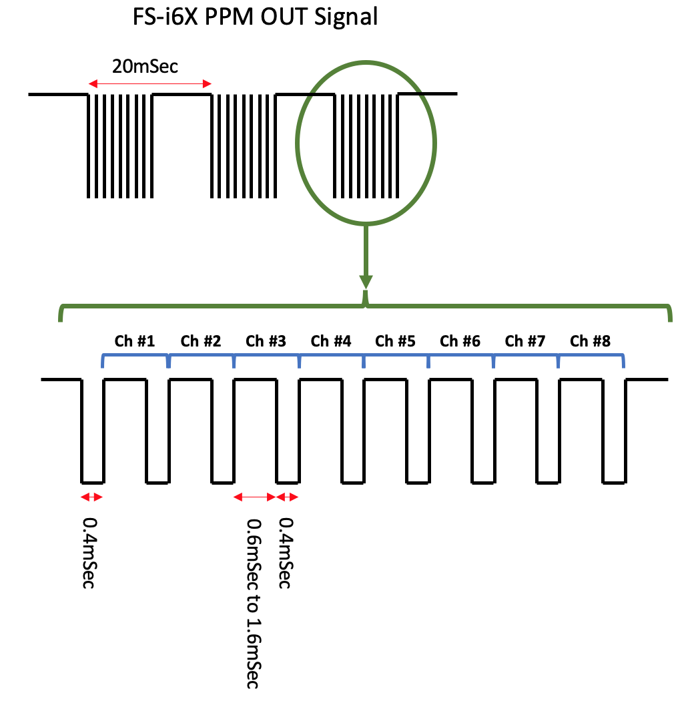
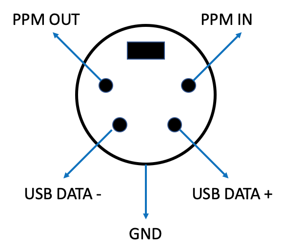

# RC buddy-box

AVR code for ATtiny84 PPM generator. The device replaces a salvaged transmitter-electronics to generate a PPM signal as a buddy-box controller. The AVR accepts five potentiometers from: four controller 'sticks' plus one 'flap' position. The AVR generates an 8-channel PPM signal from the fine control inputs as: five active and three dummy. The code makes use of Timer0 to time the short pulse and Timer1 to time the variable channel pulse duration. Two interrupt routines toggle the output line to composed a signal that is compatible with FlySky FS-i6X RC controller. Other controllers may be tested and listed here and on the [project page](https://sites.google.com/site/eyalabraham/rc-buddy-box) in the future.

## Features

- Channel reversal DIP switches for Ch.1 Rudder/Ailerons, Ch.2 Elevator, and Ch.4 Ailerons
- Stick range calibration mode
- Preserve stick calibration through power cycle

## Stick range calibration

1. Turn system OFF
2. Center all trims and sticks
3. Set calibration DIP switch to 'ON'
4. Turn ON the system
5. Move **all** sticks from minimum to maximum through full motion range (up/down or left/right)
6. When done, move calibration DIP switch to 'OFF'

> NOTE: All stick must be re-calibrated when calibration mode is entered!

To read EEPROM calibration data for verification use ```avrdude``` command line:

```
avrdude -p t84 -i 20 -c dasa -P /dev/ttyS5 -Ueeprom:r:calib.hex:i
```

## PPM Signal

RC controller PPM signal format as captured from PPM output of a FlySky FS-i6X controller. This transmitter requires the short pulses to be shorter than 500uSec. The code sets them to ~370uSec.



## Transmitter 'trainer' port

For the FlySky FS-i6X controller this port is located at the back of the system. In this hardware revision of the controller (rev 1.6) the bottom two pin are USB 2.0 and not serial Rx/Rx pins.



## ATtiny84 AVR IO

| Function                    | AVR  | Pin    | I/O       |
|-----------------------------|------|--------|-----------|
| Channel 1 (Rudder/Ailerons) | ADC0 | pin 13 | analog in |
| Channel 2 (Elevator)        | ADC1 | pin 12 | analog in |
| Channel 3 (Throttle)        | ADC2 | pin 11 | analog in |
| Channel 4 (Rudder)          | ADC3 | pin 10 | analog in |
| Channel 5 (Flaps)           | ADC4 | pin 9  | analog in |
| Channel 1 reverse           | PA5  | pin 8  | in        |
| Channel 2 reverse           | PA6  | pin 7  | in        |
| Channel 4 reverse           | PA7  | pin 6  | in        |
| Test point 1 - scope sync   | PB0  | pin 2  | out       |
| PPM signal output           | PB1  | pin 3  | out       |
| Calibration mode            | PB2  | pin 5  | in        |
| ^Reset (10K ext. pull up)   | PB3  | pin 4  | in        |

## Project files

- **buddy-box.c** - AVR code
- **sanwa-calib.hex** sample EEPROM calibration data for my hacked SANWA STAC-6 in [Intel HEX format](https://en.wikipedia.org/wiki/Intel_HEX)


